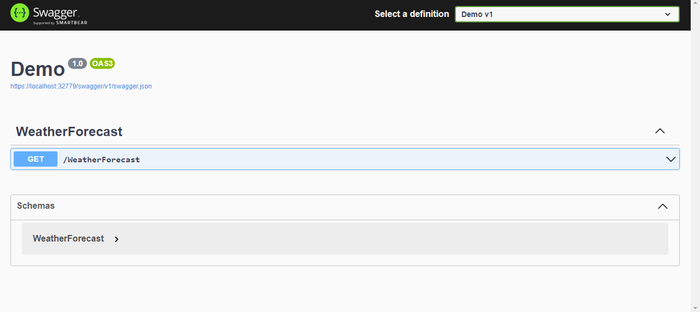

# Demo .NET 6 + Docker + Kubernetes

## 📘 Description
This repository shows ya how to run a simple demo .NET 6 webapi on a docker image.
You can also deploy it on kubernetes using the deployment.yml file.

## Prerequisites
In case you're going to run it on localhost, like me, you should install 
- docker;
- minikube. 

If you're on windows, you should first install WSL.

## Run
One you have setted it up properly, you're able to start minikube
```
minikube start
```
Deploy your app using kubernetes as orchestrator
```
minikube kubectl -- apply -f deployment.local.yml
```
And check it out on a cool dash
```
minikube dashboard
```

## Results
Minikube Dashboard


Swagger


## Clean up
If you're done, for deleting everything type
```
kubectl delete -n default deployment demo
```